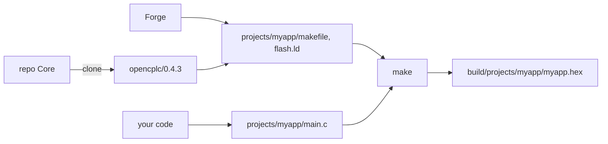

## OpenCPLC ⚒️ Forge

**Forge** is a console app that makes working with **OpenCPLC** easier.
Its job is to set up your environment so you 👨‍💻developer can focus on building apps instead of fighting with configs and compilation.
Available as a **Python [`pip`](https://pypi.org/project/opencplc)** package or standalone **`opencplc.exe`** from 🚀[Releases](https://github.com/OpenCPLC/Forge/releases) _(in that case add its location to system **PATH** manually)_

```bash
pip install opencplc
```

Just pick a folder _(your workspace)_, open [CMD](#-console) and type:

```bash
opencplc -n <project_name> -b <board>
opencplc -n myapp -b uno
```

This creates a directory _(or directory tree)_ `projects/<project_name>`.
Two files are created inside: `main.c` and `main.h`, the minimal project setup.
Don't delete them or move to subfolders.

When you have more projects, you can switch between them freely:

```bash
opencplc <project_name>
opencplc myapp
```

You can also pick projects by number from list:

```bash
opencplc -l  # show project list
opencplc 3   # load project #3 from list
```

Every project owns its `makefile` and `flash.ld`, and the `makefile` in the workspace root points at the active one.
Loading a project regenerates these files: they transform everything _(project and framework files: `.c`, `.h`, `.s`)_ into binary files `.bin`/`.hex` that can be flashed to the PLC.

Changing `PRO_x` values in **`main.h`** or the **project structure** _(adding, moving, deleting or renaming files)_ needs a reload.
`make` does it by itself: when `main.h` or the source tree is newer than the `makefile`, it runs Forge first and then builds.
Editing the body of a function needs no reload, `make` handles that on its own.
You can also reload by hand, without the project name when it's active or when you're inside its directory:

```bash
opencplc <project_name>
opencplc -r
```

Flags such as `-b`, `-c`, `-m` and `-o` configure a project only when it's created.
Later the configuration lives in `main.h`: edit it and reload.

### 📄 Your files

`main.c` is yours and Forge never overwrites it.
The skeleton of a PLC board project looks like this:

```c
#include "opencplc.h"

void loop(void)
{
  while(1) {
    LED_Set(RGB_Green);
    delay(1000);
    LED_Rst();
    delay(1000);
  }
}

stack(stack_plc, 256);
stack(stack_dbg, 256);
stack(stack_loop, 1024);

int main(void)
{
  thread(PLC_Main, stack_plc); // PLC thread
  thread(DBG_Loop, stack_dbg); // logs and console
  thread(loop, stack_loop);    // your application
  vrts_init();                 // start thread switching
  while(1);
}
```

Your application runs as a VRTS thread next to the PLC thread and the debugger thread _(logs and console)_.
Add your own modules as more files in the project directory and its subfolders.

`main.h` holds the configuration Forge reads on every load.
The `PRO_*` definitions describe the board, chip, PLC layer, framework version and memory sizes, while `LOG_LEVEL` and `SYS_CLOCK_FREQ` are yours to change.
Extra framework drivers go there too: `#define PRO_DRIVERS "shtc3, hd44780"`.

Here _(roughly)_ ends **Forge** job, and further work goes like typical **embedded systems** project using [**✨Make**](#-make).

## ✨ Make

If you have proper project config and `makefile` generated by ⚒️**Forge**, to build and flash program to PLC just open console in workspace and type:

```bash
make build  # build C project to binary
make flash  # upload binary to PLC memory
# or
make run    # run = build + flash
```

`make` in the workspace root works on the active project.
Any project can be built directly, independently of the active one: `make -C projects/myapp`.
Full list of targets:

- **`make build`** or just **`make`**: Builds C project to `.bin`, `.hex`, `.elf` files
- **`make flash`**: Uploads program to PLC _(microcontroller)_ memory
- **`make run`**: Does `make build`, then `make flash`
- **`make clean`** or `make clr`: Removes built files for the project
- `make clean_all` or `make clr_all`: Removes built files for all projects
- `make dist`: Copies the `.hex` to the project folder; `make dist TAG=1.2.0` names it `<name>-1.2.0.hex`
- **`make erase`**: Completely wipes microcontroller memory _(**erase** full chip)_
- `make stack`: Flashes the radio stack of the second core _(STM32WB)_; `make stack FUS=1` also provisions a factory board, once and irreversibly

Built files land in `build/projects/<project_name>/`: the `.elf`, `.hex`, `.bin` and `.map` next to `opencplc/` with framework objects and `project/` with yours.
Every project compiles the framework on its own, so switching projects never links objects built with another configuration.
After linking Forge reports memory usage:

```
FLASH 70.7kB / 72kB (98%)
RAM 34.3kB / 36kB (95%)
```

## ⚙️ Config

On first project ⚒️Forge creates config file **`opencplc.json`**.
It contains:

- **`version`**: Default OpenCPLC framework version for new projects. Value `latest` means newest stable version.
- `stlink`: Programmer bound to a project, so `make flash` hits the right board when several ST-Links are connected. Set with `opencplc myapp -s <serial>`, clear with `opencplc myapp -s`. Read the serial from the OpenOCD log of `make flash` with one programmer connected.
- `available-versions`: List of all available framework versions. Set automatically, used offline.

The workspace layout is fixed: `projects/` with your projects, `opencplc/` with framework versions and `build/` with built files.
Copy a project folder manually and it's detected on next run.

## 🤔 How works?

Who does what: Forge prepares the environment, Make builds and flashes, you write the code.



First **Forge** installs the **Git** client, then _(once it knows the project platform)_ **Make**, **GNU Arm Embedded Toolchain** and **OpenOCD**, and sets system variables if these apps aren't visible from console.
For HOST platform, **MinGW** _(GCC for Windows)_ is installed instead of ARM toolchain.
If you don't want anyone messing with your system, install these tools yourself and put them on **PATH**.
When ⚒️**Forge** installs missing apps, it adds them to system PATH and continues.
Restart your console afterward to use them directly.

Then if needed, it clones OpenCPLC framework from [repository](https://github.com/OpenCPLC/Core) to `opencplc/<version>`.
A new project takes the version from `opencplc.json` or the one given with `-f --framework`:

```bash
opencplc <project_name> --new -f 0.4.3
opencplc <project_name> --new -f develop
```

### 📌 Project versioning

Each project stores in `main.h` the framework version it was created with _(definition `PRO_VERSION`)_.
That version is used to build it and gets cloned when missing, so old projects compile even after framework update to newer version.
If the clone fails, Forge warns and builds with the workspace default.

To try another version without touching `main.h`, pass `-f` when loading the project: it builds with that version once and says so.

### 🧩 Boards

Ready boards come from the framework: every directory `brd/<board>/` with an `.ini` manifest is a board.
The manifest gives the defaults of a new project: whether the board needs the PLC layer, the chip, initial memory and clock, and the drivers the board needs:

```ini
name = Uno
chip = STM32G0C1
plc = true
flash_kB = 492
ram_kB = 144
clock_Hz = 59904000
reserve_kB = 20
drivers = max31865
```

`reserve_kB` is optional: flash the board keeps for itself, taken off the top exactly like the
third value of `-m`, so a project starts with what is left.

`name` is how the board reads in `main.h` and in messages, `PRO_BOARD_Uno`, while the directory stays in paths; the two compare without case or underscores, so `CardG0` and `card_g0` are the same board and `None` is reserved for having none.

Adding a board means adding a directory to the framework, nothing changes in Forge.
Those are defaults, not rules: `-c` swaps the chip _(memory then follows the chip, the clock stays with the board)_ and `--plc` adds the PLC layer to a board that does not need one.
Only `plc = true` is binding, such a board does not build without its layer.

Without a board `main.h` holds `PRO_BOARD_None`, and `PRO_PLC` decides the rest:
`-c <chip>` alone is bare metal _(HAL and libraries only)_, `-c <chip> -P` adds the PLC layer on your own hardware, where peripheral mapping and `PLC_Main` are yours to write.

Device drivers live in `dvr/`, outside the PLC layer, so any project can use them.
A board takes the ones its manifest names; a project adds more with `--dvr` at creation or in `main.h`: `#define PRO_DRIVERS "shtc3, hd44780"`.
Only the named drivers reach the build.

Main **Forge** function is preparing files needed for project:

- `projects/<name>/flash.ld`: defines RAM and FLASH memory layout _(overwrites, STM32 only)_
- `projects/<name>/makefile`: Contains build, clean and flash rules _(overwrites)_
- `makefile`: points at the active project _(overwrites)_
- `c_cpp_properties.json`: sets header paths and IntelliSense config in VS Code _(overwrites)_
- `launch.json`: configures debugging in VSCode _(overwrites)_
- `tasks.json`: describes tasks like compile or flash _(overwrites)_
- `settings.json`: sets local editor preferences _(creates once, not overwritten)_
- `extensions.json`: suggests useful VSCode extensions _(creates once, not overwritten)_

There's also bunch of helper functions accessible through smart use of [**🚩flags**](#-flags).

### 🗂️ Workspace structure

```
workspace/
├─ opencplc.json  # workspace config
├─ makefile       # active project (generated by Forge)
├─ .vscode/       # VSCode config (generated by Forge)
├─ opencplc/      # framework (downloaded automatically)
│  ├─ 0.4.3/
│  └─ develop/
├─ projects/      # user projects
│  ├─ myapp/
│  │  ├─ main.c
│  │  ├─ main.h
│  │  ├─ makefile   # generated by Forge
│  │  └─ flash.ld   # generated by Forge, STM32 only
│  ├─ firm/app/     # projects can be nested
│  └─ demo/         # projects from the Demo repository, `opencplc -e`
└─ build/         # compiled binary files
   └─ projects/myapp/
```

If IntelliSense stops working, use `F1` → _C/C++: Reset IntelliSense Database_.

## 🖥️ Host

Forge supports **Host** platform for developing and testing code on PC _(Windows/Linux)_ without embedded hardware:

```bash
opencplc -n myapp -c host  # desktop project
```

This creates project that compiles with native GCC _(MinGW on Windows)_ instead of ARM toolchain, and `make run` starts the program.
Useful for:

- Testing algorithms and logic without hardware
- Developing protocol parsers and data processing
- Unit testing framework components
- Quick prototyping before deploying to PLC

Host platform provides stub implementations for hardware-dependent modules _(GPIO, timers, etc.)_ so code structure remains compatible with STM32 targets.

## 🚩 Flags

Beyond the basic flags described above, there are a few more worth knowing.
Full list:

#### Basic

- **`name`**: Project name. Default first argument. Also defines the project path: `projects/name`, and output files _(`.bin`, `.hex`, `.elf`)_ are tied to it. Can also be a project number from the `-l` list.
- `-n --new`: Creates a new project with the given name.
- `-e --demo`: Downloads the [Demo](https://github.com/OpenCPLC/Demo) repository into `projects/demo`. Load one like any project: `opencplc demo/blinky`.
- `-r --reload`: Regenerates project files. Without **`name`** it takes the active project, or the one whose directory you're in.
- `-d --delete`: Deletes the project with the given **`name`**.
- `-g --get`: Downloads a project from Git _(**GitHub**, **GitLab**, ...)_ or a remote ZIP and adds it as a new project. The second argument _(first is the link)_ can be a reference _(`branch`, `tag`)_. If **`name`** is not specified, it tries to read it from the `@name` field in `main.h`.

#### Hardware config

- `-b --board`: Board from the framework _(`uno`)_. It sets the chip, the memory, the clock and the PLC layer of a new project; `-c` and `--plc` override that.
- `-c --chip`: Microcontroller or platform: `STM32G081`, `STM32G0C1`, `STM32WB55`, `HOST` _(compile for PC)_. Without `-b --board`, the project runs without the PLC layer, only HAL and standard framework libraries. Useful for Nucleo boards or custom hardware.
- `-P --plc`: Adds the PLC layer to a project without a board, on your own hardware.
- `-D --dvr`: Framework drivers of a new project, comma separated _(`shtc3, hd44780`)_. Later ones go into `PRO_DRIVERS` in `main.h`.
- `-m --memory`: Memory in kB: `FLASH RAM [RESERVED]`. `RESERVED` is the memory allocated for config and EEPROM, subtracted from FLASH in the linker file `flash.ld`. _(STM32 only)_

#### Build config

- `-f --framework`: Framework version: `latest`, `develop`, `0.4.3`. For a new project it becomes `PRO_VERSION`; for an existing one it builds with that version once.
- `-o --opt-level`: Compiler optimization level: `O0`, `Og` _(default)_, `O1`, `O2`, `O3`. Levels `O2` and `O3` show a warning for STM32 _(timing, debugging)_.
- `-s --stlink`: Binds an ST-Link serial to the project; `-s` alone clears the binding.

#### Info

- `-l --list`: Lists existing projects.
- `-i --info`: Returns basic info about the specified or active project, including project and framework versions.
- `-F --framework-versions`: Lists all available OpenCPLC framework versions.
- `-v --version`: Shows the ⚒️Forge version and repository link.

#### Tools

- `-a --assets`: Downloads helper materials for design _(docs, diagrams)_. Optionally accepts a folder name as destination.
- `-u --update`: Replace the Forge executable with the given version _(default: `latest`)_; a `pip` install updates through `pip` instead.
- `-z --size`: Reports FLASH and RAM usage of an `.elf`; `make` uses it after linking.
- `-y --yes`: Auto-confirms all prompts _(non-interactive mode)_.

#### Hash utilities

- `-hl --hash-list`: Generates an enum with DJB2 hashes from a tag list.
- `-ht --hash-title`: Enum type name for the hash generator.
- `-hd --hash-define`: Uses `#define` instead of `enum` for hash output.

🗑️ Deleting and 💾 copying projects can be done directly from the OS.
Each project stores all the information it needs in `main.h`, and its presence is auto-detected on startup.

## 📟 Console

⚒️Forge and ✨Make are console programs.
Essential for working with OpenCPLC.

System console is available in many apps like **Command Prompt**, **PowerShell**, [**GIT Bash**](https://git-scm.com/downloads), even terminal in [**VSCode**](https://code.visualstudio.com/).
Forge finds the workspace from any directory inside it, so a project directory is a fine place to open the console too.

When something goes wrong:

- Forge lands in the wrong workspace: a stray `opencplc.json` sits somewhere between the project and the real root, remove it.
- Compiler not found right after the tools were installed: the console still has the old `PATH`, close it and open a new one.
- `make` stops at `opencplc -r` with an error about the version or the board: `main.h` points at something this framework doesn't have, fix the entry and run `make` again.
- A project is missing from `-l`: its directory has no `main.h`.

## 📋 Usage examples

```bash
# Creating new project
opencplc -n myapp -b uno                    # project for OpenCPLC Uno board
opencplc -n myapp -b uno -m 128 36          # project for Uno with 128kB/36kB memory
opencplc -n myapp -c STM32G081 --plc        # own hardware with PLC layer (no peripheral mapping)
opencplc -n myapp -c STM32G081              # bare-metal project for STM32G081 (e.g. Nucleo)
opencplc -n myapp -c STM32G081 --dvr shtc3  # bare metal with the shtc3 driver
opencplc -n myapp -c host                   # desktop project (Windows/Linux)

# Managing projects
opencplc myapp              # load project 'myapp'
opencplc 3                  # load project #3 from list
opencplc -r                 # reload active project
opencplc -l                 # list all projects
opencplc -i                 # info about active project
opencplc myapp -s 066AFF49  # bind ST-Link to 'myapp'

# Demo projects
opencplc -e                 # download Demo to projects/demo
opencplc demo/blinky        # load project 'blinky'

# Downloading projects
opencplc -g https://github.com/user/repo
opencplc -g https://github.com/user/repo v1.0.0

# Updates
opencplc -u  # update Forge to latest version
opencplc -F  # show available Core versions
```
