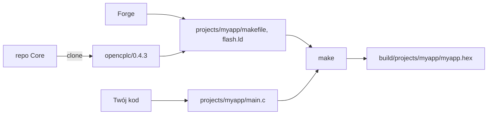

## OpenCPLC ⚒️ Forge

**Forge** jest aplikacją konsolową usprawniającą pracę z **OpenCPLC**, którego zadaniem jest dostosowanie środowiska pracy tak, aby 👨‍💻programista-automatyk mógł skupić się na tworzeniu aplikacji, a nie walce z konfiguracją ekosystemu i kompilacją programu.
Dostępny jest jako pakiet **Python [`pip`](https://pypi.org/project/opencplc)** lub jako samodzielny plik wykonywalny **`opencplc.exe`** z 🚀[Releases](https://github.com/OpenCPLC/Forge/releases) _(w tym przypadku należy ręcznie dodać jego lokalizację do zmiennych systemowych **PATH**)_

```sh
pip install opencplc
```

Po prostu w wybranej lokalizacji _(którą uznasz za workspace)_ odpal [CMD](#-console) i wpisz:

```sh
opencplc -n <project_name> -b <board>
opencplc -n myapp -b uno
```

Wówczas tworzony jest katalog _(lub drzewo katalogów)_ `projects/<project_name>`.
Powstają w nim dwa pliki: `main.c` i `main.h`, które stanowią minimalny zestaw plików projektu.
Nie można ich usuwać ani przenosić do podkatalogów.

Gdy będziemy mieli więcej projektów, będziemy mogli swobodnie przełączać się między nimi.

```sh
opencplc <project_name>
opencplc myapp
```

Projekty możemy też wybierać po numerze z listy:

```sh
opencplc -l  # wyświetl listę projektów
opencplc 3   # załaduj projekt #3 z listy
```

Każdy projekt ma własny `makefile` i `flash.ld`, a `makefile` w katalogu workspace wskazuje na aktywny projekt.
Załadowanie projektu generuje te pliki na nowo: to one przekształcają całość _(pliki projektu i framework'a: `.c`, `.h`, `.s`)_ w pliki wsadowe `.bin`/`.hex`, które można wgrać do sterownika jako działający program.

Zmiana wartości konfiguracyjnych `PRO_x` w pliku **`main.h`** albo **struktury projektu** _(dodawanie, przenoszenie, usuwanie lub zmiana nazw plików)_ wymaga przeładowania projektu.
`make` robi to sam: gdy `main.h` albo drzewo źródeł jest nowsze od pliku `makefile`, najpierw uruchamia Forge, a potem buduje.
Zwykła edycja treści funkcji nie wymaga przeładowania, tym zajmuje się już sam `make`.
Można też przeładować ręcznie, bez podawania nazwy, gdy projekt jest aktywny albo gdy stoimy w jego katalogu:

```sh
opencplc <project_name>
opencplc -r
```

Flagi takie jak `-b`, `-c`, `-m` i `-o` konfigurują projekt tylko przy jego tworzeniu.
Później konfiguracja mieszka w `main.h`: edytujesz i przeładowujesz.

### 📄 Twoje pliki

`main.c` należy do Ciebie i Forge nigdy go nie nadpisuje.
Szkielet projektu dla sterownika PLC wygląda tak:

```c
#include "opencplc.h"

void loop(void)
{
  while(1) {
    LED_Set(RGB_Green);
    delay(1000);
    LED_Rst();
    delay(1000);
  }
}

stack(stack_plc, 256);
stack(stack_dbg, 256);
stack(stack_loop, 1024);

int main(void)
{
  thread(PLC_Main, stack_plc); // wątek sterownika
  thread(DBG_Loop, stack_dbg); // logi i konsola
  thread(loop, stack_loop);    // Twoja aplikacja
  vrts_init();                 // start przełączania wątków
  while(1);
}
```

Aplikacja działa jako wątek systemu VRTS obok wątku sterownika i wątku debuggera _(logi i konsola)_.
Własne moduły dokładasz jako kolejne pliki w katalogu projektu i jego podkatalogach.

`main.h` przechowuje konfigurację, którą Forge odczytuje przy każdym załadowaniu projektu.
Definicje `PRO_*` opisują płytkę, chip, warstwę PLC, wersję framework'a i rozmiary pamięci, a `LOG_LEVEL` i `SYS_CLOCK_FREQ` zmieniasz wedle potrzeb.
Tam też wpisujesz dodatkowe drivery framework'a: `#define PRO_DRIVERS "shtc3, hd44780"`.

Tutaj _(upraszczając)_ kończy się zadanie programu **Forge**, a dalsza praca przebiega tak samo jak w typowym projekcie **embedded systems**, czyli przy użyciu [**✨Make**](#-make).

## ✨ Make

Jeżeli mamy poprawnie przygotowaną konfigurację projektu oraz plik `makefile` wygenerowany za pomocą programu ⚒️**Forge**, to aby zbudować i wgrać program na sterownik PLC, wystarczy otworzyć konsolę w przestrzeni roboczej _(workspace)_ i wpisać:

```sh
make build  # buduj projekt C do programu binarnego
make flash  # wgraj plik binarny do pamięci sterownika PLC
# lub
make run    # run = build + flash
```

`make` w katalogu workspace pracuje na aktywnym projekcie.
Każdy projekt można też zbudować bezpośrednio, niezależnie od aktywnego: `make -C projects/myapp`.
Pełna lista celów:

- **`make build`** lub samo **`make`**: Buduje projekt w języku C do postaci plików wsadowych `.bin`, `.hex`, `.elf`
- **`make flash`**: Wgrywa plik wsadowy programu do pamięci sterownika PLC _(mikrokontrolera)_
- **`make run`**: Wykonuje `make build`, a następnie `make flash`
- **`make clean`** lub `make clr`: Usuwa zbudowane pliki projektu
- `make clean_all` lub `make clr_all`: Usuwa zbudowane pliki wszystkich projektów
- `make dist`: Kopiuje `.hex` do folderu projektu; `make dist TAG=1.2.0` nazwie go `<name>-1.2.0.hex`
- **`make erase`**: Całkowicie czyści pamięć mikrokontrolera _(**erase** full chip)_
- `make stack`: Wgrywa stos radiowy drugiego rdzenia _(STM32WB)_; `make stack FUS=1` robi też jednorazowy, nieodwracalny provisioning fabrycznej płytki

Zbudowane pliki trafiają do `build/projects/<project_name>/`: `.elf`, `.hex`, `.bin` i `.map` obok katalogu `opencplc/` z obiektami framework'a i `project/` z Twoimi.
Każdy projekt kompiluje framework na własny użytek, więc przełączanie projektów nigdy nie linkuje obiektów zbudowanych z inną konfiguracją.
Po linkowaniu Forge raportuje zajętość pamięci:

```
FLASH 70.7kB / 72kB (98%)
RAM 34.3kB / 36kB (95%)
```

## ⚙️ Config

Przy pierwszym projekcie ⚒️Forge tworzy plik konfiguracyjny **`opencplc.json`**.
Zawiera on:

- **`version`**: Domyślna wersja framework'a OpenCPLC dla nowych projektów. Wartość `latest` oznacza najnowszą stabilną wersję.
- `stlink`: Programator przypisany do projektu, dzięki czemu `make flash` trafia we właściwą płytkę, gdy podłączonych jest kilka ST-Linków. Ustawiasz przez `opencplc myapp -s <serial>`, czyścisz przez `opencplc myapp -s`. Numer seryjny odczytasz z logu OpenOCD przy `make flash`, mając podłączony jeden programator.
- `available-versions`: Lista wszystkich dostępnych wersji framework'a. Ustawiana automatycznie, używana offline.

Układ workspace jest stały: `projects/` z Twoimi projektami, `opencplc/` z wersjami framework'a i `build/` z plikami zbudowanymi.
Projekt skopiowany ręcznie do `projects/` zostaje wykryty przy następnym uruchomieniu.

## 🤔 How works?

Kto co robi: Forge przygotowuje środowisko, Make buduje i wgrywa, Ty piszesz kod.



W pierwszej kolejności **Forge** zainstaluje klienta **Git**, a gdy pozna platformę projektu, również **Make**, **GNU Arm Embedded Toolchain** i **OpenOCD** oraz ustawi odpowiednio zmienne systemowe, jeżeli aplikacje nie są widoczne w systemie z poziomu konsoli.
Dla platformy HOST zamiast toolchain'a ARM instalowany jest **MinGW** _(GCC dla Windows)_.
Jeżeli nie chcemy, aby ktoś grzebał w naszym systemie, instalujemy te narzędzia sami i dodajemy je do **PATH**.
Gdy ⚒️**Forge** zainstaluje brakujące aplikacje, doda je do systemowego PATH i będzie kontynuować pracę.
Po zakończeniu zrestartuj konsolę, aby korzystać z nich bezpośrednio.

Następnie, w razie konieczności, sklonuje framework OpenCPLC z [repozytorium](https://github.com/OpenCPLC/Core) do katalogu `opencplc/<wersja>`.
Nowy projekt dostaje wersję z pliku `opencplc.json` albo wskazaną za pomocą `-f --framework`:

```sh
opencplc <project_name> --new -f 0.4.3
opencplc <project_name> --new -f develop
```

### 📌 Wersjonowanie projektu

Każdy projekt przechowuje w pliku `main.h` wersję framework'a, na której został utworzony _(definicja `PRO_VERSION`)_.
Na tej wersji jest budowany, a gdy jej brakuje, Forge ją klonuje, więc starsze projekty kompilują się nawet po aktualizacji framework'a.
Jeśli klonowanie się nie powiedzie, Forge ostrzega i buduje na domyślnej wersji workspace.

Aby sprawdzić inną wersję bez ruszania `main.h`, podaj `-f` przy ładowaniu projektu: zbuduje się z nią jednorazowo i powie o tym.

### 🧩 Płytki

Gotowe płytki pochodzą z framework'a: każdy katalog `brd/<board>/` z manifestem `.ini` jest płytką.
Manifest podaje wartości domyślne nowego projektu: czy płytka potrzebuje warstwy PLC, chip, początkową pamięć i zegar oraz drivery, których płytka potrzebuje:

```ini
name = Uno
chip = STM32G0C1
plc = true
flash_kB = 492
ram_kB = 144
clock_Hz = 59904000
reserve_kB = 20
drivers = max31865
```

`reserve_kB` jest opcjonalne: to flash, który płytka zostawia dla siebie, odejmowany od góry
dokładnie jak trzecia wartość `-m`, więc projekt startuje z tym, co zostaje.

`name` to nazwa płytki w `main.h` i w komunikatach, `PRO_BOARD_Uno`, a katalog zostaje w ścieżkach; porównują się bez wielkości liter i podkreślników, więc `CardG0` i `card_g0` to ta sama płytka, a `None` jest zarezerwowane dla jej braku.

Dodanie płytki to dodanie katalogu do framework'a, w Forge nic się nie zmienia.
To wartości domyślne, nie reguły: `-c` podmienia chip _(pamięć idzie wtedy za chipem, zegar zostaje przy płytce)_, a `--plc` dokłada warstwę PLC płytce, która jej nie potrzebuje.
Wiążące jest tylko `plc = true`, bo taka płytka bez swojej warstwy się nie zbuduje.

Bez płytki w `main.h` stoi `PRO_BOARD_None`, a o resztę dba `PRO_PLC`:
samo `-c <chip>` to goły mikrokontroler _(tylko HAL i biblioteki)_, a `-c <chip> -P` dokłada warstwę PLC na własnym sprzęcie, gdzie mapowanie peryferiów i `PLC_Main` piszesz sam.

Drivery urządzeń mieszkają w `dvr/`, poza warstwą PLC, więc może z nich korzystać każdy projekt.
Płytka bierze te, które wymienia jej manifest, a projekt dokłada kolejne flagą `--dvr` przy tworzeniu albo w `main.h`: `#define PRO_DRIVERS "shtc3, hd44780"`.
Do builda trafiają wyłącznie wymienione drivery.

Główną funkcją **Forge**'a jest przygotowanie plików niezbędnych do pracy z wybranym projektem:

- `projects/<name>/flash.ld`: definiuje rozkład pamięci RAM i FLASH mikrokontrolera _(nadpisuje, tylko STM32)_
- `projects/<name>/makefile`: zawiera reguły budowania, czyszczenia i flashowania projektu _(nadpisuje)_
- `makefile`: wskazuje na aktywny projekt _(nadpisuje)_
- `c_cpp_properties.json`: ustawia ścieżki do nagłówków i konfigurację IntelliSense w VS Code _(nadpisuje)_
- `launch.json`: konfiguruje debugowanie w VSCode _(nadpisuje)_
- `tasks.json`: opisuje zadania takie jak kompilacja czy flashowanie _(nadpisuje)_
- `settings.json`: ustawia lokalne preferencje edytora _(tworzy raz, nie nadpisuje)_
- `extensions.json`: sugeruje przydatne rozszerzenia do VSCode _(tworzy raz, nie nadpisuje)_

Istnieje także całkiem sporo funkcji pomocniczych, do których dostęp uzyskuje się za pomocą sprytnego wykorzystania [**🚩flag**](#-flags).

### 🗂️ Struktura workspace

```
workspace/
├─ opencplc.json  # konfiguracja workspace
├─ makefile       # aktywny projekt (generowany przez Forge)
├─ .vscode/       # konfiguracja VSCode (generowana przez Forge)
├─ opencplc/      # framework (pobierany automatycznie)
│  ├─ 0.4.3/
│  └─ develop/
├─ projects/      # projekty użytkownika
│  ├─ myapp/
│  │  ├─ main.c
│  │  ├─ main.h
│  │  ├─ makefile   # generowany przez Forge
│  │  └─ flash.ld   # generowany przez Forge, tylko STM32
│  ├─ firm/app/     # projekty mogą być zagnieżdżone
│  └─ demo/         # projekty z repozytorium Demo, `opencplc -e`
└─ build/         # skompilowane pliki wsadowe
   └─ projects/myapp/
```

Jeśli IntelliSense przestanie działać poprawnie, użyj `F1` → _C/C++: Reset IntelliSense Database_.

## 🖥️ Host

Forge wspiera platformę **Host** do rozwijania i testowania kodu na PC _(Windows/Linux)_ bez sprzętu embedded:

```sh
opencplc -n myapp -c host  # projekt desktopowy
```

Tworzy to projekt kompilowany natywnym GCC _(MinGW na Windows)_ zamiast toolchain'a ARM, a `make run` uruchamia program.
Przydatne do:

- Testowania algorytmów i logiki bez sprzętu
- Rozwijania parserów protokołów i przetwarzania danych
- Testów jednostkowych komponentów framework'a
- Szybkiego prototypowania przed wdrożeniem na PLC

Platforma HOST dostarcza stub'y dla modułów zależnych od sprzętu _(GPIO, timery, itp.)_, więc struktura kodu pozostaje kompatybilna z targetami STM32.

## 🚩 Flags

#### Podstawowe

- **`name`**: Nazwa projektu, domyślny pierwszy argument. Wyznacza ścieżkę `projects/name` i jest powiązana z plikami wsadowymi _(`.bin`, `.hex`, `.elf`)_. Można też podać numer z listy `-l`.
- `-n --new`: Tworzy nowy projekt o wskazanej nazwie.
- `-e --demo`: Pobiera repozytorium [Demo](https://github.com/OpenCPLC/Demo) do `projects/demo`. Ładujesz je jak każdy projekt: `opencplc demo/blinky`.
- `-r --reload`: Regeneruje pliki projektu. Bez `name` bierze projekt aktywny albo ten, w którego katalogu stoisz.
- `-d --delete`: Usuwa projekt o wskazanej nazwie.
- `-g --get`: Pobiera projekt z GitHub/GitLab lub zdalnego ZIP i dodaje jako nowy. Drugi argument to referencja _(`branch`, `tag`)_. Jeśli `name` nie podano, odczytuje go z `@name` w `main.h`.

#### Konfiguracja sprzętu

- `-b --board`: Płytka z framework'a _(`uno`)_. Ustawia chip, pamięć, zegar i warstwę PLC nowego projektu; `-c` i `--plc` to nadpisują.
- `-c --chip`: Mikrokontroler lub platforma: `STM32G081`, `STM32G0C1`, `STM32WB55`, `HOST`. Bez `-b` projekt działa bez warstwy PLC, tylko HAL i biblioteki standardowe. Przydatne dla Nucleo lub własnego hardware.
- `-P --plc`: Dokłada warstwę PLC do projektu bez płytki, na własnym sprzęcie.
- `-D --dvr`: Drivery framework'a nowego projektu, po przecinku _(`shtc3, hd44780`)_. Kolejne dopisujesz w `PRO_DRIVERS` w `main.h`.
- `-m --memory`: Pamięć w kB: `FLASH RAM [RESERVED]`. `RESERVED` zostaje odjęte od FLASH w pliku linkera `flash.ld`. _(tylko STM32)_

#### Konfiguracja kompilacji

- `-f --framework`: Wersja frameworka: `latest`, `develop`, `0.4.3`. Dla nowego projektu staje się `PRO_VERSION`, dla istniejącego buduje z nią jednorazowo.
- `-o --opt-level`: Poziom optymalizacji: `O0`, `Og` _(domyślny)_, `O1`, `O2`, `O3`. Poziomy `O2`/`O3` wyświetlają ostrzeżenie dla STM32 _(timing, debugowanie)_.
- `-s --stlink`: Przypisuje numer seryjny ST-Linka do projektu; samo `-s` czyści przypisanie.

#### Informacje

- `-l --list`: Wyświetla listę projektów.
- `-i --info`: Zwraca informacje o wskazanym lub aktywnym projekcie, w tym wersje projektu i frameworka.
- `-F --framework-versions`: Wyświetla dostępne wersje frameworka OpenCPLC.
- `-v --version`: Wyświetla wersję ⚒️Forge i link do repozytorium.

#### Narzędzia

- `-a --assets`: Pobiera materiały pomocnicze _(dokumentacja, diagramy)_. Opcjonalnie przyjmuje nazwę folderu docelowego.
- `-u --update`: Podmienia plik wykonywalny Forge na wskazaną wersję _(domyślnie `latest`)_; instalację z `pip` aktualizuje się przez `pip`.
- `-z --size`: Raportuje zajętość FLASH i RAM pliku `.elf`; `make` używa tego po linkowaniu.
- `-y --yes`: Automatycznie potwierdza wszystkie pytania _(tryb nieinteraktywny)_.

#### Hash utilities

- `-hl --hash-list`: Generuje enum z hashem DJB2 dla listy tagów.
- `-ht --hash-title`: Nazwa typu enum dla generatora hashy.
- `-hd --hash-define`: Używa `#define` zamiast `enum`.

🗑️ Usuwanie i 💾 kopiowanie projektów można wykonywać bezpośrednio z poziomu systemu operacyjnego.
Każdy projekt przechowuje wszystkie niezbędne informacje w pliku `main.h`, a jego obecność jest automatycznie wykrywana podczas uruchamiania programu.

## 📟 Console

Programy ⚒️Forge oraz ✨Make są programami uruchamianymi z konsoli CMD.
Stanowią niezbędnik do pracy z OpenCPLC.

Konsola systemowa jest dostępna w wielu aplikacjach, takich jak **Command Prompt**, **PowerShell**, [**GIT Bash**](https://git-scm.com/downloads), a nawet terminal w [**VSCode**](https://code.visualstudio.com/).
Forge znajduje workspace z dowolnego katalogu w jego wnętrzu, więc konsolę można otworzyć także w katalogu projektu.

Gdy coś nie działa:

- Forge trafia w zły workspace: gdzieś między projektem a właściwym katalogiem leży resztkowy `opencplc.json`, usuń go.
- Brak kompilatora zaraz po instalacji narzędzi: konsola ma jeszcze stary `PATH`, zamknij ją i otwórz nową.
- `make` zatrzymuje się na `opencplc -r` z błędem o wersji albo płytce: `main.h` wskazuje na coś, czego ten framework nie ma, popraw wpis i uruchom `make` ponownie.
- Projektu nie ma na liście `-l`: w jego katalogu brakuje `main.h`.

## 📋 Przykłady użycia

```sh
# Tworzenie nowego projektu
opencplc -n myapp -b uno                    # projekt dla sterownika OpenCPLC Uno
opencplc -n myapp -b uno -m 128 36          # projekt dla Uno z pamięcią 128kB/36kB
opencplc -n myapp -c STM32G081 --plc        # własny hardware z warstwą PLC (bez mapowania peryferiów)
opencplc -n myapp -c STM32G081              # projekt bare-metal dla STM32G081 (np. Nucleo)
opencplc -n myapp -c STM32G081 --dvr shtc3  # bare-metal z driverem shtc3
opencplc -n myapp -c host                   # projekt desktopowy (Windows/Linux)

# Zarządzanie projektami
opencplc myapp              # załaduj projekt 'myapp'
opencplc 3                  # załaduj projekt #3 z listy
opencplc -r                 # przeładuj aktywny projekt
opencplc -l                 # lista wszystkich projektów
opencplc -i                 # informacje o aktywnym projekcie
opencplc myapp -s 066AFF49  # przypisz ST-Link do 'myapp'

# Przykłady demonstracyjne
opencplc -e                 # pobierz Demo do projects/demo
opencplc demo/blinky        # załaduj projekt 'blinky'

# Pobieranie projektów
opencplc -g https://github.com/user/repo
opencplc -g https://github.com/user/repo v1.0.0

# Aktualizacje
opencplc -u  # aktualizuj Forge do najnowszej wersji
opencplc -F  # pokaż dostępne wersje Core
```
